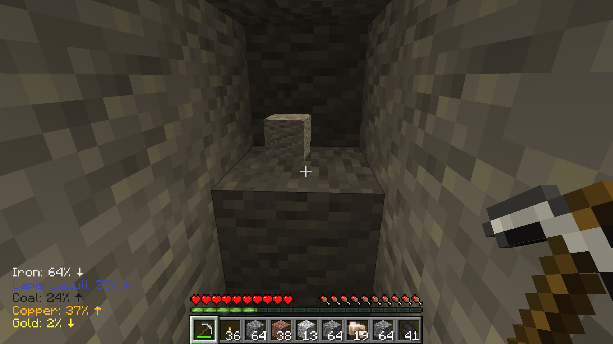
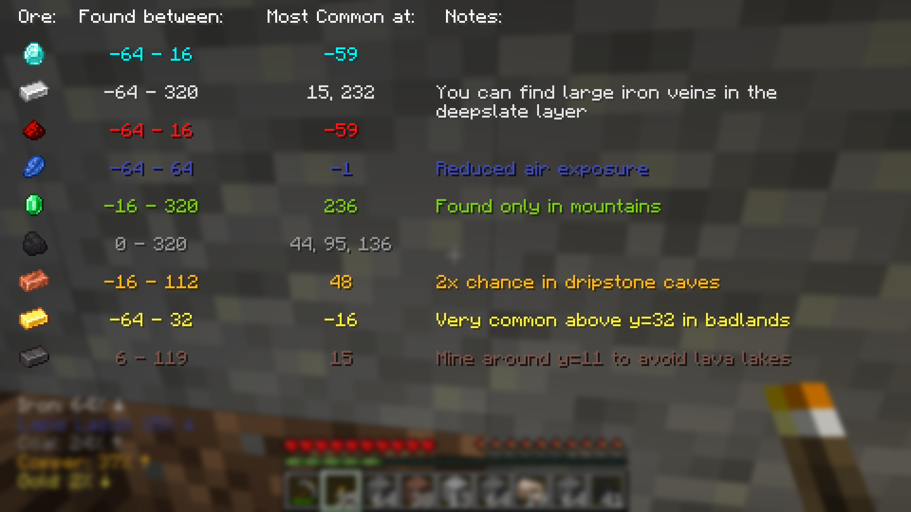
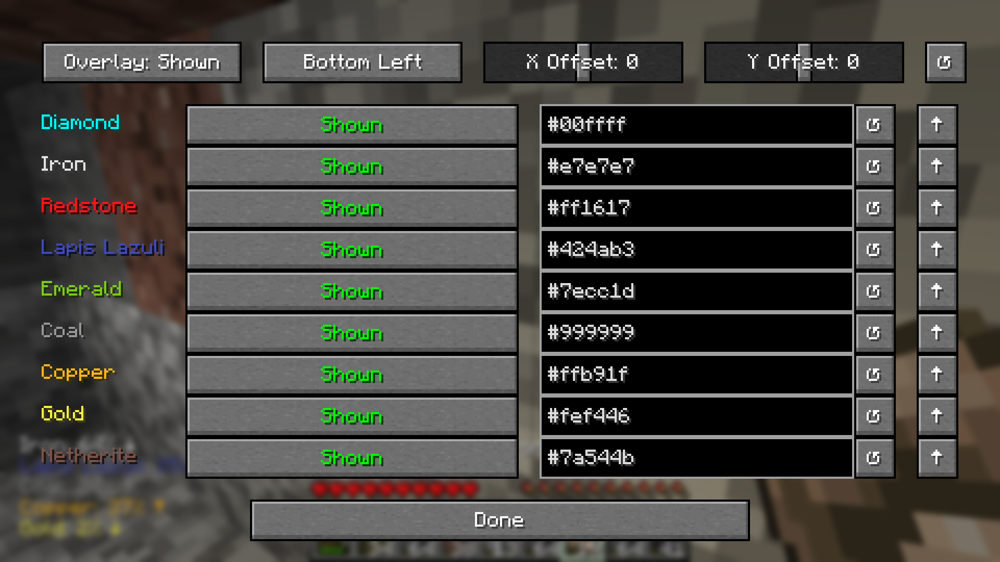

# Miner's Guide
## A client side Minecraft mod using [Fabric](https://fabricmc.net/), that implements a couple of UI-based elements to help guide players with the ore distribution system in Minecraft.

## Features
- **Text Overlay:** 
  - Overlays text on the screen to show what ores are available, what chance you have to find them, and which direction to go to increase that chance.

  

- **Distribution Screen:**  
  - Adds a screen that can be accessed by pressing the default key: M.
  - The screen displays information on where to find each ore.
    
  

- **Fully Customizable:**
  - A config screen is accessable through the [mod menu](https://modrinth.com/mod/modmenu) that allows for full customizability of the overlay
 
  

## Installation
1. Ensure you have [Fabric](https://fabricmc.net/use/installer/) installed.
2. Download the Miner's Guide JAR file from the [releases](https://github.com/bcawley1/ore-distribution/releases) section of this repository.
3. Place the downloaded JAR file into your `mods` folder.
4. Ensure that you have the latest version of [Fabric API](https://modrinth.com/mod/fabric-api) installed as well.
5. (Optional) Install the latest version of [Mod Menu](https://modrinth.com/mod/modmenu).
## Dependencies
- The latest version of [Fabric API](https://modrinth.com/mod/fabric-api).
- (Optional But Highly Recommended) The latest version of [Mod Menu](https://modrinth.com/mod/modmenu).
## License
- This plugin is released under the [MIT License](LICENSE).